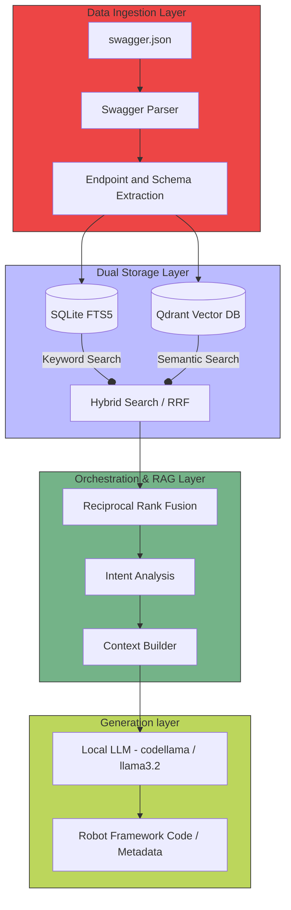
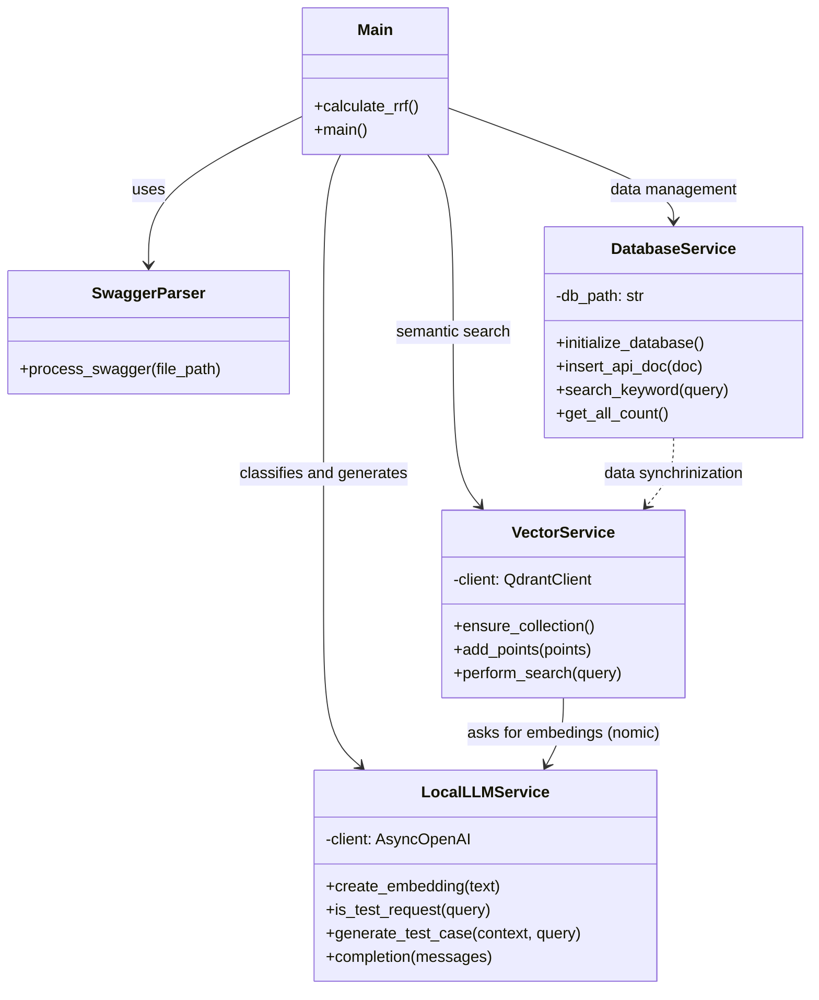
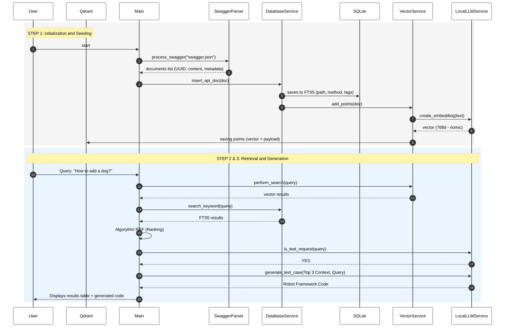
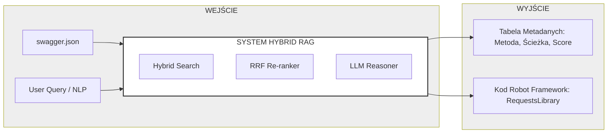

1. Conceptual Block Diagram This diagram illustrates the high-level system structure, from the data source to the generative output.

2. Component Architecture Detailed relationships between classes within your Python code.

3. Workflow (Data Flow) A sequence diagram illustrating the two main processes: Indexing and Querying (RAG).

4. Schemat Input/Output
Diagram wejść i wyjść systemu.

Podsumowanie techniczne zawarte w diagramach:
Dual-Storage: Rozdzielenie wyszukiwania na SQLite (FTS5) dla słów kluczowych (np. dokładne nazwy endpointów) i Qdrant dla semantyki (kontekst "dodawania").
Model Embeddingów: Wykorzystanie modelu nomic-embed-text (wymiar 768) realizowane przez LocalLLMService.
Hybrid Search: Połączenie wyników za pomocą RRF (Reciprocal Rank Fusion), co zapewnia, że najbardziej trafne dokumenty z obu silników trafiają do kontekstu LLM.
Generacja: Specjalizacja modelu codellama w generowaniu skryptów dla Robot Framework przy użyciu biblioteki RequestsLibrary.